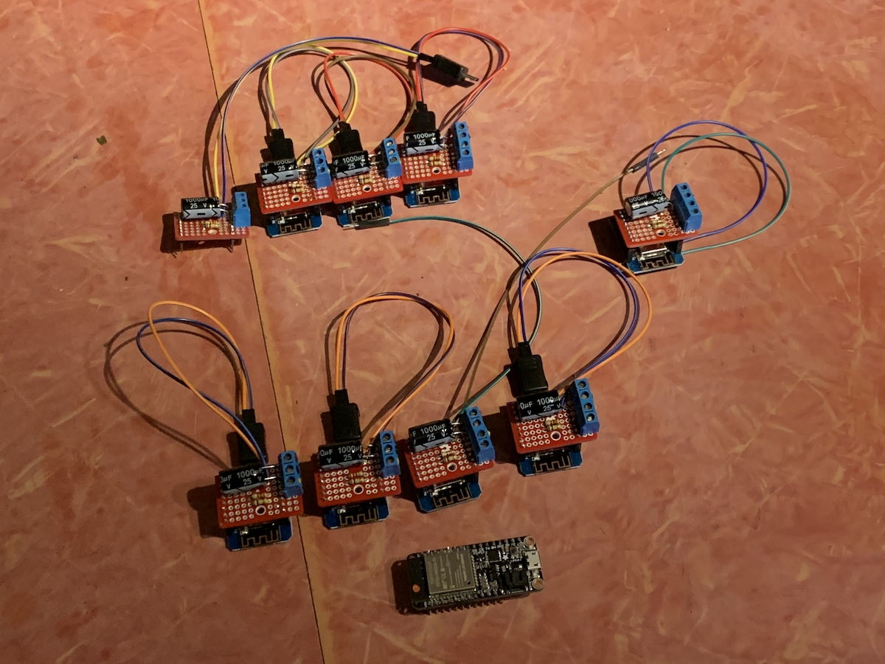

# Canal Convergence Interactive Sculpture
A touch-responsive inflatable sculpture for the 2019 Canal Convergence event in Scottsdale, AZ, November 8-15. A collaboration between artist [Nicole Banowetz](http://www.nicolebanowetz.com) and technologist [Bryan Costanza](http://somuchscience.com/).

[Jump to Documentation](#documentation)

## Arduino IDE Setup
### Libraries to Install
- FastLED

### Boards to Install
- ESP8266 `https://arduino.esp8266.com/stable/package_esp8266com_index.json`
- ESP32 `https://dl.espressif.com/dl/package_esp32_index.json`

### Boards to Select on Upload
- LongSiteLeft, LongSiteRight, ShortSite are "Adafruit HUAZZAH32" or something like that
- Medallion is "Adafruit HUZZAH8266" or something like that
- Each capacitive touch finger sensor board is a WEMOS D1 mini (not Pro or Lite)

## IP Addresses
IP Addresses are reserved as
- 192.168.0.**100** for LongSiteLeft
- 192.168.0.**101** for LongSiteRight
- 192.168.0.**102** for ShortSite
- 192.168.0.**103** for Medallion

## Test Color Temporarily
The controllers recognize basic commands sent by short UDP strings with strict formatting restrictions. 

### Start a UDP Connection
#### From a Mac
Open Terminal and type `nc -u 192.168.0.xxx 8052` where 
- `nc` is sort of a Terminal program for sending network messages
- `-u` specifies UDP protocol
- `xxx` is specific to each controller (see above)
- `8052` is the port that each controller is listening on. 

#### From an iPhone
Similar functionality as above can be found with these iOS apps
- https://apps.apple.com/us/app/tcp-udp-client/id906830843
- https://apps.apple.com/us/app/udp-terminal/id1399547636

### Change Medallion only
October 20, 2019 -- Only the colors can be changed by UDP message. The format to change the color is:
- `c-----` the `c` prefix is used to indicate a color command
- `-i----` the `i` indicates that changes will apply to the inner/center color
- `-o----` the `o` indicates that changes will apply to the outer/background color
- `--r---` changes the red value of the RGB color, accepts 0-255 (but possibly a bug limiting some values)
- `--g---` same as above but for green
- `--b---` same as above but for blue
- `cib100` specifies a value of 100 for blue component of the inner color, for example
- Note that all commands must be six characters long, so color values less than 100 must be zero-padded, like `050`, for example 
- `000000` resets the board to recover initial settings

### Change LongSiteLeft, LongSiteRight, & ShortSite
- `c-----` the `c` prefix is used to indicate a color command
- `-a----` the `a` indicates that changes will apply to the initial/resting color ("toxic" green in this case)
- `-b----` the `b` same as above but for secondary/activated color (reddish in this case)
- `-c----` the `c` same as above but for tertiary color (turquoise in this case)
- `--r---` changes the red value of the RGB color, accepts 0-255 (but possibly a bug limiting some values)
- `--g---` same as above but for green
- `--b---` same as above but for blue
- `cab100` specifies a value of 100 for blue component of the initial color, for example
- Note that all commands must be six characters long, so color values less than 100 must be zero-padded, like `050`, for example

## Other Notes

The Fingers 1-9 have IP Addresses assigned 110-118, though this is not important as the code is written at the moment except as a confirmation of uploading the correct file with over-the-air updates.

# Documentation

